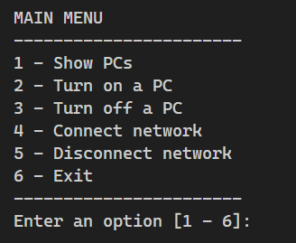

# Red-Computadoras

I've made this project based on the class of **"Lenguajes de Programación III"** which I'm currently cursing at **UNAH-VS**.

I'm also using this to practice further C++ development.

Currently I'm separating my code in **Definition files** (.h) and **Implementation files** (.cpp)

But I'm also learning to use of **Makefile**, which I'm putting in practice in this project which main functionalities are:

- Reviewing the state of all PCs inside a Network.
- Changing the state from **off** to **on** and viceversa.
- Connecting and disconnecting an specific PC from the network.

## Main menu screenshot

