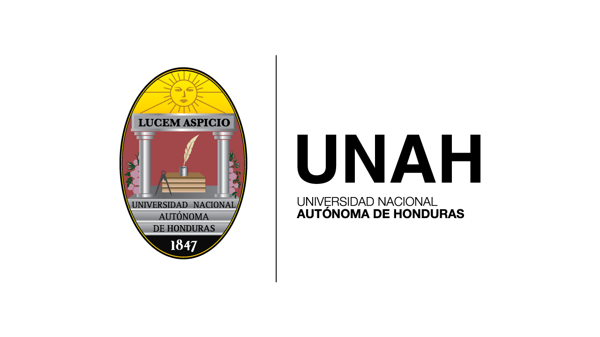

# Red de Computadoras

Proyecto para repasar los conceptos de **Programación Orientada a Objetos**.
El ejecutable del programa se puede encontrar [aquí](https://github.com/CMRicardo/Red-Computadoras/releases).

## Clase

Lenguajes de Programación III

## Sección

0900

## Integrantes

- **Ricardo Corrales** - 20202000211
- **Walther Guerra** - ###########

## Principales funciones del programa

- **Revisar** el estado de las PCs del laboratorio.
- Manipular el estado de las PCs, tanto la **corriente** como la **conexión a la red**.
- **Descargar** archivos a una PC en específico.
- **Copiar archivos** entre 2 PCs.

## Capturas de Pantalla

### Menú principal

### Estado de la red

### Creditos

